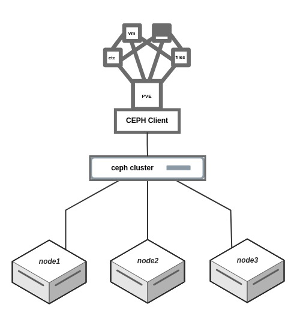

# Ceph Orchestrator
Topologi:



# Panduan Instalasi dan Konfigurasi
> Testing on Debian 11 + Ceph Quincy

Ikuti langkah-langkah di bawah ini untuk mengatur sistem menggunakan Ansible dan Ceph.
1. Pastikan host memiliki paket ansible dan telah mempersiapkan [inventory](ansible/inventory).

2. Jalankan playbook Ansible untuk melakukan instalasi awal dengan perintah:
    ```
    cd ansible
    ansible-playbook -i inventory first-install.yml -e "HOSTS=ceph"
    ```
3. Buka terminal node1 dan ikuti langkah-langkah untuk [membuat cephadm](docs/adm-mon-mgr.md).
4. [Cara menambahkan host](docs/hosts.md), pastikan daemon telah disesuaikan ( `osd` / `mon` / `mgr` ).
5. [Cara membuat osd](docs/osd.md)
6. [Masalah umum](docs/troubleshooting.md)
