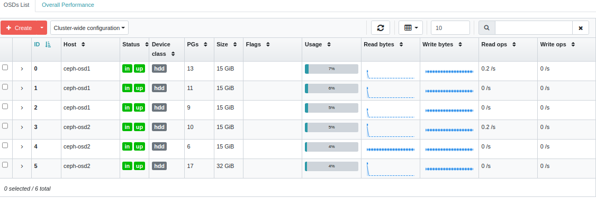
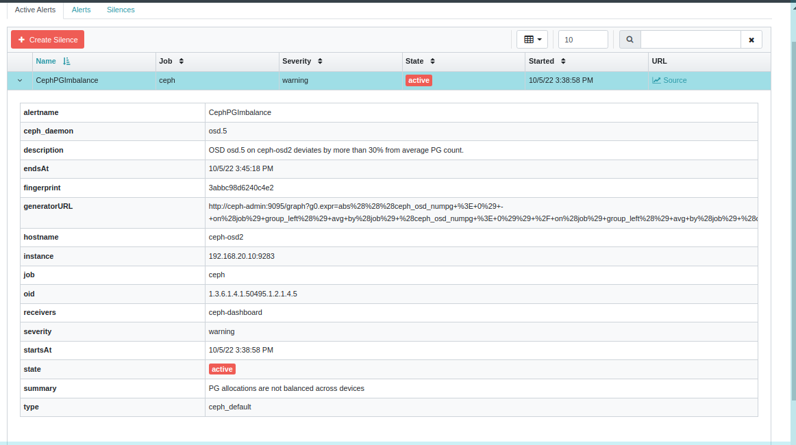

## Troubleshooting
### HEALTH_WARN 1 daemons have recently crashed | RECENT_CRASH: 1 daemons have recently crashed
To display a list of messages:
```
ceph crash ls
```
If you want to read the message:
```
ceph crash info <id>
```
then:
```
ceph crash archive <id>
```
or:
```
ceph crash archive-all
```

## mgr
### show mgr service
```
ceph mgr services
```
### show mgr module
```
ceph mgr module ls
```

### dashboard
```
ceph mgr module enable dashboard
ceph dashboard create-self-signed-cert
```

## Users
### Show existing users:
```
ceph dashboard ac-user-show [USERNAME]
```
Create a new user:
```
ceph dashboard ac-user-create USERNAME -i [PASSWORD_FILE] [ROLENAME] [NAME] [EMAIL]
```
Delete a user:
```
ceph dashboard ac-user-delete USERNAME
```
Change a user's password:
```
ceph dashboard ac-user-set-password USERNAME -i PASSWORD_FILE
```
Disable user
```
ceph dashboard ac-user-disable USERNAME
```
Enable User
```
ceph dashboard ac-user-enable USERNAME
```

## Ceph Admin
Show log
```
ceph log last cephadm
```

### CEPHADM_STRAY_HOST: 1 stray host(s) with 1 daemon(s) not managed by cephadm
```
#ceph health detail
HEALTH_WARN 1 stray host(s) with 1 daemon(s) not managed by cephadm
[WRN] CEPHADM_STRAY_HOST: 1 stray host(s) with 1 daemon(s) not managed by cephadm
    stray host ceph-admin has 1 stray daemons: ['mon.ceph-mon-mgr']
```
then, remove daemon
```
ceph orch daemon rm mon.ceph-mon-mgr --force
```
### MGR_MODULE_ERROR: Module 'devicehealth' has failed:
```
ceph mgr module disable devicehealth
ceph mgr module enable devicehealth
```
or
1. Create a new manager , if you already have a second manager go to step two
2. delete the first manager ( there is no data loss here ) , wait for the standby one to become active
3. Recreate the initial manager , the pool is back


### CEPHADM_FAILED_DAEMON: 1 failed cephadm daemon(s) 
```
ceph orch daemon rm <osd.$?> --force
```

### Error initializing cluster client: ObjectNotFound('RADOS object not found (error calling conf_read_file)')
Make sure of file /etc/ceph/ceph.conf is available

###  -1 auth: unable to find a keyring on
Make sure keyring is available


### To set the number of object replicas on a replicated pool, execute the 
```
ceph osd pool set <poolname> size <num-replicas>
```


### If the disk size is not the same, it will get a CephPGImbalance alert




#### https://stackoverflow.com/questions/39589696/ceph-too-many-pgs-per-osd-all-you-need-to-know


### Notes
#### How to calculate PGs
Total PGs per pool Calculation:
Total PGs = ((Total_number_of_OSD * 100) / max_replication_count) / pool count

This result must be rounded up to the nearest power of 2.

1. Number of OSD
```
ceph osd ls
```
Sample Output:
```
 0
 1
 2
 ```
 Here Total number of osd is three.
2. Number of Pools
```
ceph osd pool ls or rados lspools
```
Sample Output:
```
  rbd
  images
  vms
  volumes
  backups
```     
Here Total number of pool is five.
3. Replication Count
```
ceph osd dump | grep repli
```
Sample Output:
 ```
 pool 0 'rbd' replicated size 2 min_size 2 crush_ruleset 0 object_hash rjenkins pg_num 64 pgp_num 64 last_change 38 flags hashpspool stripe_width 0
 pool 1 'images' replicated size 2 min_size 2 crush_ruleset 1 object_hash rjenkins pg_num 30 pgp_num 30 last_change 40 flags hashpspool stripe_width 0
 pool 2 'vms' replicated size 2 min_size 2 crush_ruleset 1 object_hash rjenkins pg_num 30 pgp_num 30 last_change 42 flags hashpspool stripe_width 0
 pool 3 'volumes' replicated size 2 min_size 2 crush_ruleset 1 object_hash rjenkins pg_num 30 pgp_num 30 last_change 36 flags hashpspool stripe_width 0
 pool 4 'backups' replicated size 2 min_size 2 crush_ruleset 1 object_hash rjenkins pg_num 30 pgp_num 30 last_change 44 flags hashpspool stripe_width 0
```
You can see each pool has replication count two.
Now Let get into calculation

Calculations:
Total PGs Calculation:
Total PGs = (Total_number_of_OSD * 100) / max_replication_count

This result must be rounded up to the nearest power of 2.
Example:

No of OSD: 3
No of Replication Count: 2

Total PGs = (3 * 100) / 2 = 150. Nearest Power of 150 to 2 is 256.

So Maximum Recommended PGs is 256

You can set PG for every Pool

Total PGs per pool Calculation:
Total PGs = ((Total_number_of_OSD * 100) / max_replication_count) / pool count

This result must be rounded up to the nearest power of 2.
Example:

No of OSD: 3
No of Replication Count: 2
No of pools: 5
```
Total PGs = ((3 * 100) / 2 ) / 5 = 150 / 5 = 30 
```

So Total No of PGs per pool is 32.

Power of 2 Table:
```
2^0     1
2^1     2
2^2     4
2^3     8
2^4     16
2^5     32
2^6     64
2^7     128
2^8     256
2^9     512
2^10    1024
```


### Fixing HEALTH_WARN too many PGs per OSD (352 > max 300) once and for all
When balancing placement groups you must take into account:

Data we need
pgs per osd
pgs per pool
pools per osd
the crush map
reasonable default pg and pgp num
replica count
I will use my set up as an example and you should be able to use it as a template for your own.

Data we have
num osds : 4
num sites: 2
pgs per osd: ???
pgs per pool: ???
pools per osd: 10
reasonable default pg and pgp num: 64 (... or is it?)
replica count: 2 (cross site replication)
the crush map
```
ID   WEIGHT  TYPE NAME      UP/DOWN REWEIGHT PRIMARY-AFFINITY
root ourcompnay
  site a
    rack a-esx.0
      host prdceph-strg01
          osd.0                up  1.00000          1.00000
          osd.1                up  1.00000          1.00000
   site b
     rack a-esx.0
      host prdceph-strg02
          osd.2                up  1.00000          1.00000
          osd.3                up  1.00000          1.00000

```
Our goal is to fill in the '???' above with what we need to serve a HEALTH OK cluster. Our pools are created by the rados gateway when it initialises. We have a single default.rgw.buckets.data where all data is being stored the rest of the pools are adminitrastive and internal to cephs metadata and book keeping.

PGs per osd (what is a reasonable default anyway???)
The documentation would have us use this calculation to determine our pg count per osd:

 (osd * 100)
----------- = pgs UP to nearest power of 2
 replica count
It is stated that to round up is optimal. So with our current setup it would be:

 (4 * 100)
----------- = (200 to the nearest power of 2) 256
    2
osd.1 ~= 256
osd.2 ~= 256
osd.3 ~= 256
osd.4 ~= 256
This is the recommended max number of pgs per osd. So... what do you actually have currently? And why isn't it working? And if you set a 'reasonable default' and understand the above WHY ISN'T IT WORKING!!! >=[

Likely, a few reasons. We have to understand what those 'reasonable defaults' above actually mean, how ceph applies them and to where. One might misunderstand from the above that I could create a new pool like so:
```
ceph osd pool create <pool> 256 256
```
or I might even think I could play it safe and follow the documentation which states that (128 pgs for < 5 osds) can use:
```
ceph osd pool create <pool> 128 128
```
This is wrong, flat out. Because it in no way explains the relationship or balance between what ceph is actaully doing with these numbers technically the correct answer is:
```
ceph osd pool create <pool> 32 32
```
And let me explain why:
If like me you provisioned your cluster with those 'reasonable defaults' (128 pgs for < 5 osds) as soon as you tried to do anything with rados it created a whole bunch of pools and your cluster spazzed out. The reason is because I misunderstood the relationship between everything mentioned above.

pools: 10 (created by rados)
pgs per pool: 128 (recommended in docs)
osds: 4 (2 per site)
10 * 128 / 4 = 320 pgs per osd

This ~320 could be a number of pgs per osd on my cluster. But ceph might distribute these differently. Which is exactly what's happening and is way over the 256 max per osd stated above. My cluster's HEALTH WARN is HEALTH_WARN too many PGs per OSD (368 > max 300).

Using this command we're able to see better the relationship between the numbers:
```
pool :17 18  19  20  21  22  14  23  15  24  16 | SUM
------------------------------------------------< - *total pgs per osd*
osd.0 35 36  35  29  31  27  30  36  32  27  28 | 361
osd.1 29 28  29  35  33  37  34  28  32  37  36 | 375
osd.2 27 33  31  27  33  35  35  34  36  32  36 | 376
osd.3 37 31  33  37  31  29  29  30  28  32  28 | 360
-------------------------------------------------< - *total pgs per pool*
SUM :128 128 128 128 128 128 128 128 128 128 128
```
There's a direct correlation between the number of pools you have and the number of placement groups that are assigned to them. I have 11 pools in the snippet above and they each have 128 pgs and that's too many!! My reasonable defaults are 64! So what happened??

I was misunderstandning how the 'reasonable defaults' were being used. When I set my default to 64, you can see ceph has taking my crush map into account where I have a failure domain between site a and site b. Ceph has to ensure that everything that's on site a is at least accessible on site b.

WRONG
site a
osd.0
osd.1 TOTAL of ~ 64pgs

site b
osd.2 
osd.3 TOTAL of ~ 64pgs
We needed a grand total of 64 pgs per pool so our reasonable defaults should've actually been set to 32 from the start!

If we use ceph osd pool create <pool> 32 32 what this amounts to is that the relationship between our pgs per pool and pgs per osd with those 'reasonable defaults' and our recommened max pgs per osd start to make sense:

So you broke your cluster ^_^
Don't worry we're going to fix it. The procedure here I'm afraid might vary in risk and time depending on how big your cluster. But the only way to get around altering this is to add more storage, so that the placement groups can redistribute over a larger surface area. OR we have to move everything over to newly created pools.

I'll show an example of moving the default.rgw.buckets.data pool:
```
old_pool=default.rgw.buckets.data
new_pool=new.default.rgw.buckets.data
create a new pool, with the correct pg count:
ceph osd pool create $new_pool 32
```
copy the contents of the old pool the new pool:
```
rados cppool $old_pool $new_pool
```
remove the old pool:
```
ceph osd pool delete $old_pool $old_pool --yes-i-really-really-mean-it
```
rename the new pool to 'default.rgw.buckets.data'
ceph osd pool rename $new_pool $old_pool

Now it might be a safe bet to restart your radosgws.

FINALLY CORRECT
site a
osd.0
osd.1 TOTAL of ~ 32pgs

site b
osd.2 
osd.3 TOTAL of ~ 32pgs
As you can see my pool numbers have incremented since they are added by pool id and are new copies. And our total pgs per osd is way under the ~256 which gives us room to add custom pools if required.
```
pool :  26 35 27 36 28 29 30 31 32 33 34 | SUM
-----------------------------------------------
osd.0   15 18 16 17 17 15 15 15 16 13 16 | 173
osd.1   17 14 16 15 15 17 17 17 16 19 16 | 179
osd.2   17 14 16 18 12 17 18 14 16 14 13 | 169
osd.3   15 18 16 14 20 15 14 18 16 18 19 | 183
-----------------------------------------------
SUM :   64 64 64 64 64 64 64 64 64 64 64 
```
Now you should test your ceph cluster with whatever is at your disposal. Personally I've written a bunch of python over boto that tests the infrastructure and return buckets stats and metadata rather quickly. They have ensured to me that the cluster is back to working order without any of the issues it suffered from previously. Good luck!

Fixing pool default.rgw.buckets.data has many more objects per pg than average (too few pgs?) once and for all
This quite literally means, you need to increase the pg and pgp num of your pool. So... do it. With everything mentioned above in mind. When you do this however note that the cluster will start backfilling and you can watch this process %: watch ceph -s in another terminal window or screen.

ceph osd pool set default.rgw.buckets.data pg_num 128
ceph osd pool set default.rgw.buckets.data pgp_num 128
Armed with the knowledge and confidence in the system provided in the above segment we can clearly understand the relationship and the influence of such a change on the cluster.
```
pool :  35 26 27 36 28 29 30 31 32 33 34 | SUM
----------------------------------------------
osd.0   18 64 16 17 17 15 15 15 16 13 16 | 222
osd.1   14 64 16 15 15 17 17 17 16 19 16 | 226
osd.2   14 66 16 18 12 17 18 14 16 14 13 | 218
osd.3   18 62 16 14 20 15 14 18 16 18 19 | 230
-----------------------------------------------
SUM :   64 256 64 64 64 64 64 64 64 64 64 
```
Can you guess which pool id is default.rgw.buckets.data? haha ^_^


### Menentukan PGS
```
ceph pg dump | awk '
BEGIN { IGNORECASE = 1 }
 /^PG_STAT/ { col=1; while($col!="UP") {col++}; col++ }
 /^[0-9a-f]+\.[0-9a-f]+/ { match($0,/^[0-9a-f]+/); pool=substr($0, RSTART, RLENGTH); poollist[pool]=0;
 up=$col; i=0; RSTART=0; RLENGTH=0; delete osds; while(match(up,/[0-9]+/)>0) { osds[++i]=substr(up,RSTART,RLENGTH); up = substr(up, RSTART+RLENGTH) }
 for(i in osds) {array[osds[i],pool]++; osdlist[osds[i]];}
}
END {
 printf("\n");
 printf("pool :\t"); for (i in poollist) printf("%s\t",i); printf("| SUM \n");
 for (i in poollist) printf("--------"); printf("----------------\n");
 for (i in osdlist) { printf("osd.%i\t", i); sum=0;
   for (j in poollist) { printf("%i\t", array[i,j]); sum+=array[i,j]; sumpool[j]+=array[i,j] }; printf("| %i\n",sum) }
 for (i in poollist) printf("--------"); printf("----------------\n");
 printf("SUM :\t"); for (i in poollist) printf("%s\t",sumpool[i]); printf("|\n");
}'
```

### Bind url 
Bind url by RDNS 